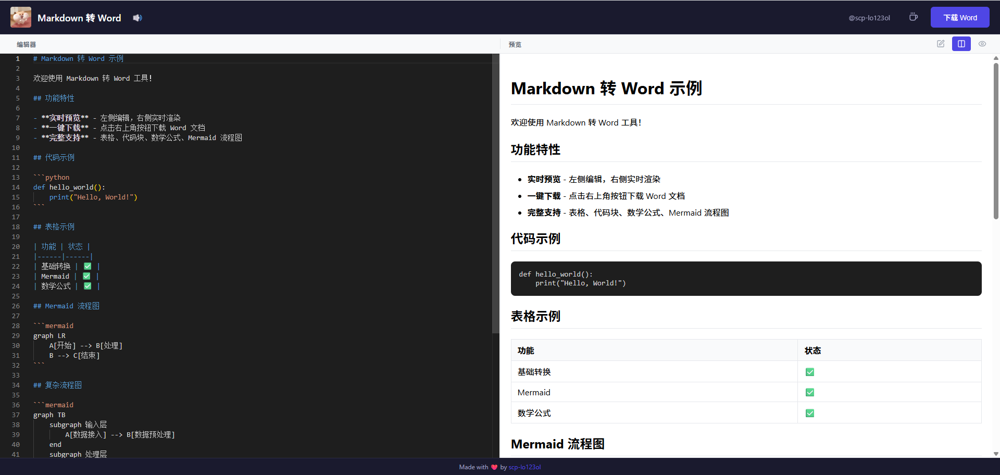
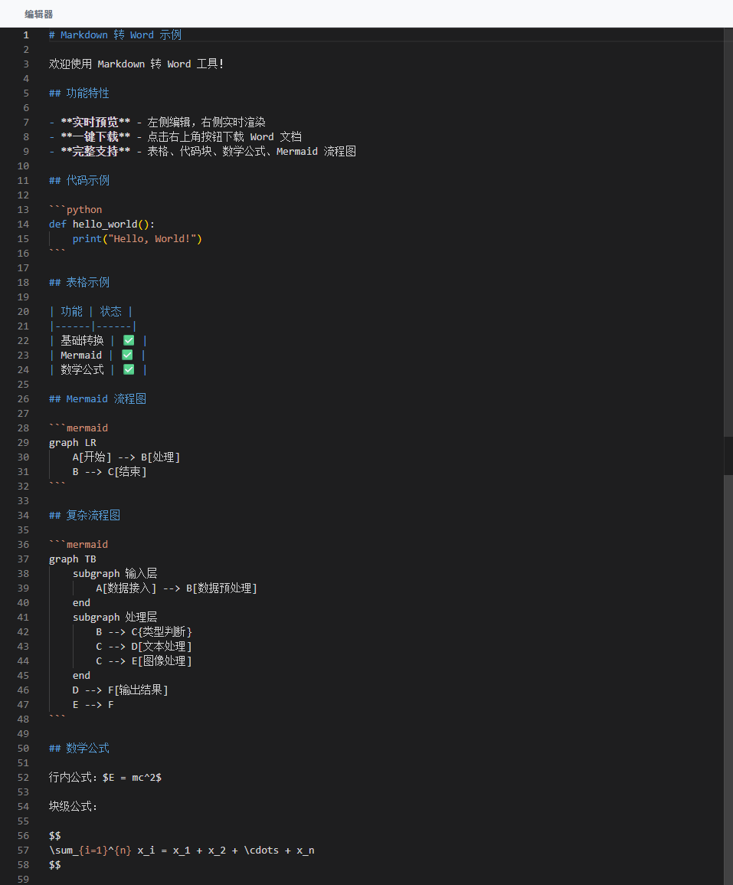
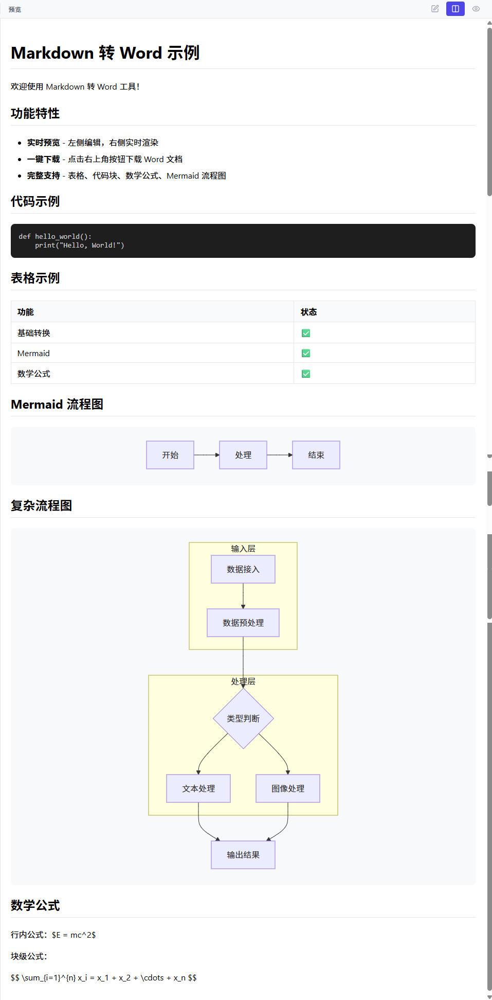
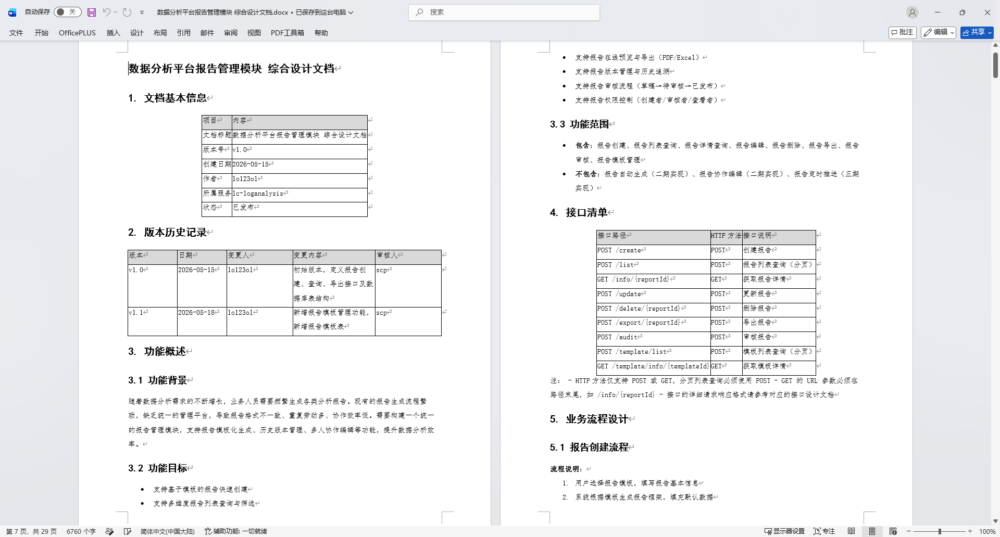
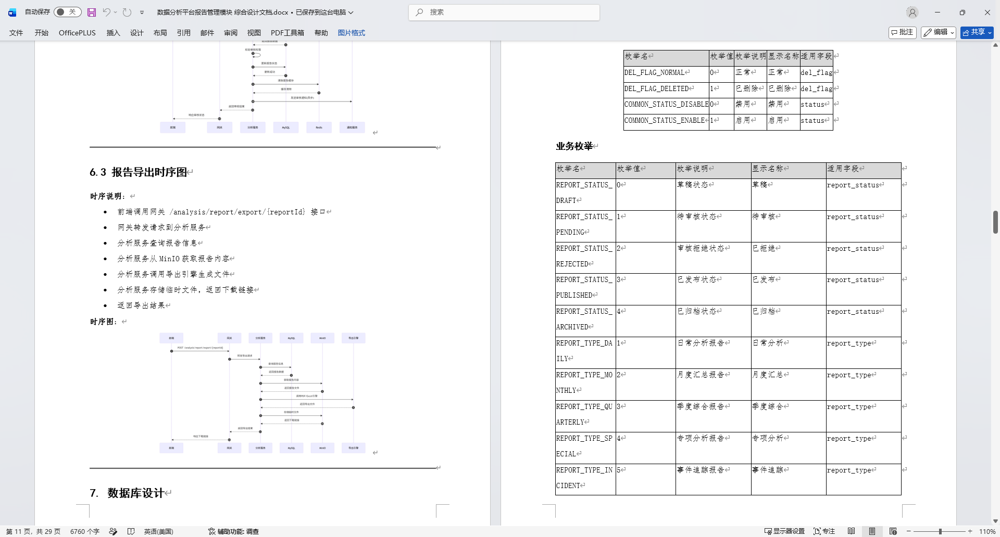

# Markdown 转 Word

<p align="center">
  <strong>一个支持实时预览的 Markdown 转 Word Web 应用</strong>
</p>

<p align="center">
  <a href="#功能特性">功能</a> •
  <a href="#快速开始">开始</a> •
  <a href="#部署">部署</a> •
  <a href="#支持作者">支持</a>
</p>

---

## 功能特性

- 📝 **实时编辑** - Monaco Editor 编辑器，VS Code 同款体验
- 👀 **实时预览** - 边写边看，所见即所得
- 🔄 **视图切换** - 支持纯编辑、编辑+预览、纯预览三种模式
- 📜 **滚动同步** - 编辑+预览模式下左右双向同步滚动
- 📥 **一键导出** - 导出专业格式 Word 文档（.docx）
- ✨ **完整支持** - 表格、代码块、数学公式、Mermaid 流程图
- 📂 **拖拽上传** - 支持 .md / .txt 文件拖拽导入

## 技术栈

| 前端 | 后端 |
|------|------|
| React 19 | Node.js |
| Vite | Express |
| TypeScript | TypeScript |
| Monaco Editor | Pandoc |
| Lucide Icons | |

## 快速开始

### 前置要求

- Node.js 18+
- Pandoc（用于 Word 转换）

### 安装 Pandoc

```bash
# macOS
brew install pandoc

# Windows
choco install pandoc

# Linux (Debian/Ubuntu)
sudo apt-get install pandoc
```

### 本地开发

```bash
# 克隆项目
git clone https://github.com/scp-lo123ol/md2word-converter.git
cd md2word-converter

# 启动后端
cd backend
npm install
npm run dev

# 启动前端（新终端）
cd frontend
npm install
npm run dev
```

打开浏览器访问 http://localhost:3000

## 部署

### Docker

```bash
# 构建镜像
docker build -t md2word-converter .

# 运行
docker run -p 3001:3001 md2word-converter
```

### Docker Compose

```bash
docker-compose up -d
```

访问 http://localhost:3001

## 配置

### Mermaid 渲染服务

默认使用本地渲染。如需远程渲染服务，点击右上角「配置」按钮设置地址。

## 截图

### 编辑界面

<p align="center">
  
</p>

<p align="center">
  <em>编辑+预览模式 - 左右分栏，实时同步滚动</em>
</p>

### 视图切换

<p align="center">
  
  
</p>

<p align="center">
  <em>三种视图模式：纯编辑 | 编辑+预览 | 纯预览</em>
</p>

### 导出效果

<p align="center">
  
  
</p>

<p align="center">
  <em>导出的 Word 文档效果展示</em>
</p>

## 支持作者

如果这个工具对你有帮助，欢迎支持作者继续开发 🙏

<p align="center">
  
</p>

## License

[AGPL-3.0](LICENSE)

---

<p align="center">
  Made with ❤️ by <a href="https://github.com/scp-lo123ol">scp-lo123ol</a>
</p>